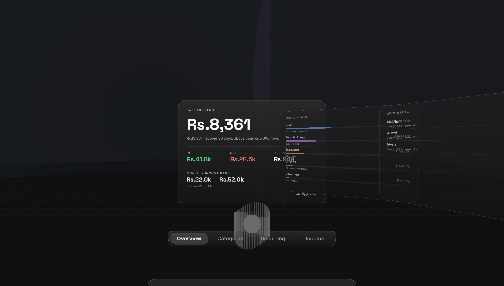
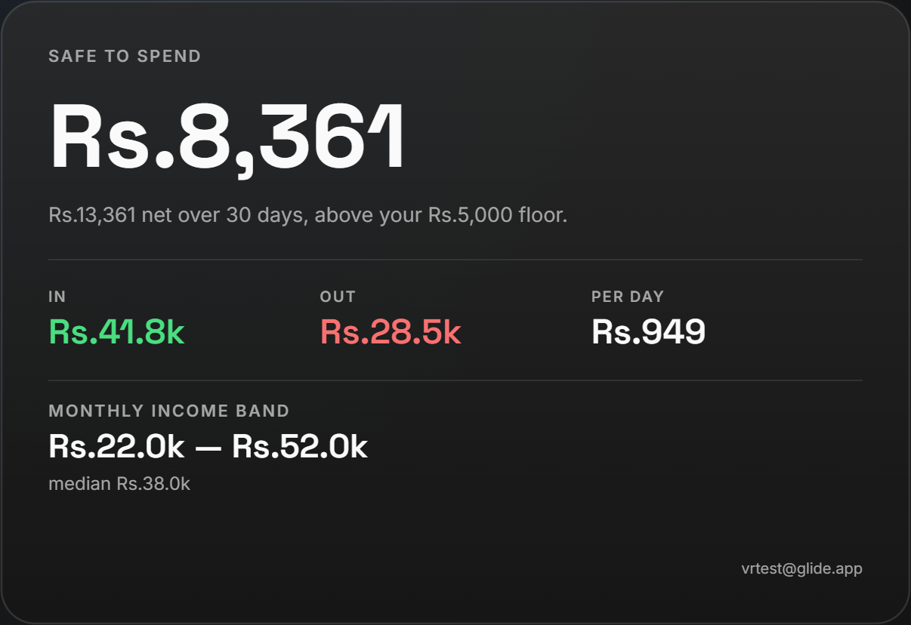
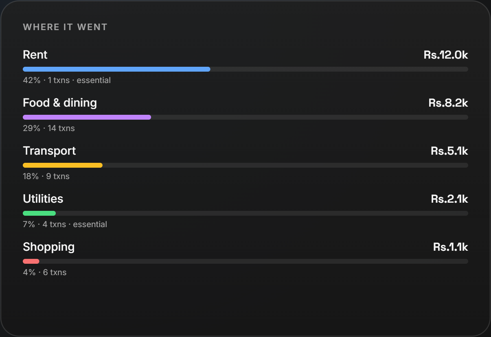
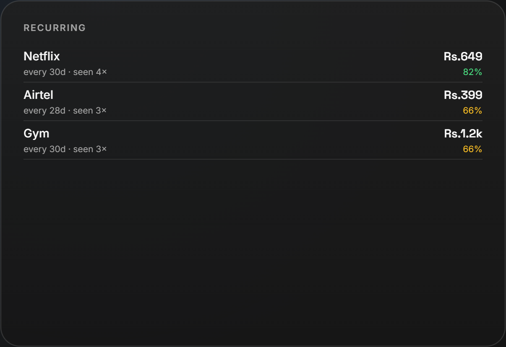
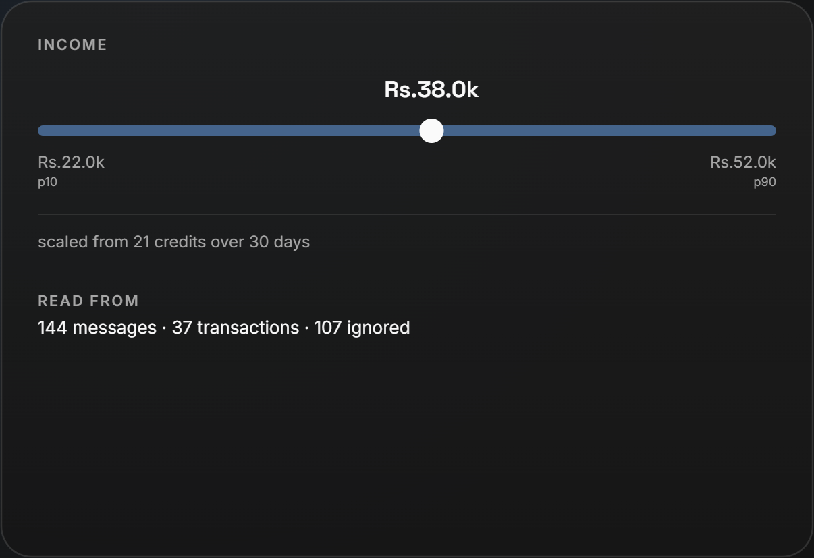
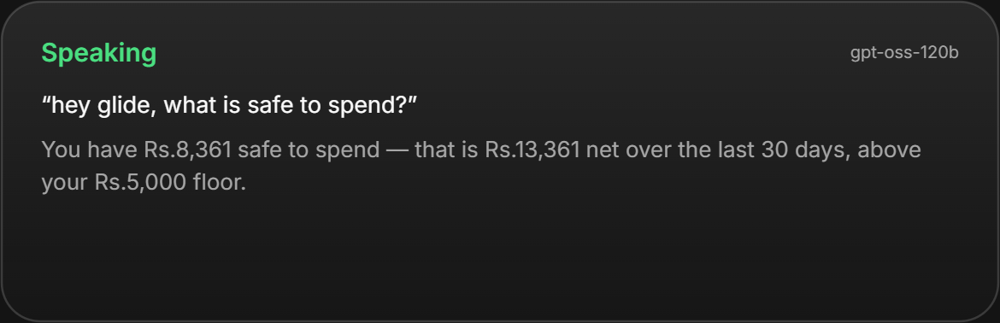
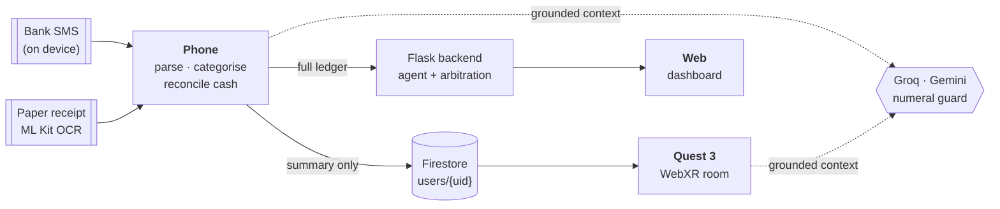

<div align="center">

<picture>
  <source media="(prefers-color-scheme: dark)" srcset="docs/logo-dark.png">
  <source media="(prefers-color-scheme: light)" srcset="docs/logo-light.png">
  
</picture>

### Every budgeting app assumes you get paid on the 1st.

**Glide is for the ~90% of India's workforce that doesn't.**
Gig drivers, freelancers, small traders, commission earners — irregular amounts, irregular days.
Glide reads the bank alerts already sitting in your inbox, **on your phone**, and answers the
only question that matters: *what is actually safe to spend right now.*

<br>

[](https://manage-buddy.web.app)
[](https://manage-buddy.web.app/vr/)
[](https://github.com/vgsguru/glide-csi-origin/releases/latest)

<br>



<sub>Glide on Meta Quest 3 — four glass panels on an arc at arm's length, an assistant orb below.<br>
Rendered live from the app. Figures shown are from a demo account.</sub>

</div>

---

## The problem

Ask a conventional budgeting app *"can I afford this?"* and it answers from a monthly salary
that doesn't exist. So people fall back on checking their bank balance — which tells them what
they **have**, never what they can **safely spend** before rent, the EMI and the school fee land.

The tools that do exist want your bank credentials or a statement upload. Most people won't,
and shouldn't have to.

## What Glide actually does

Your bank already texts you every time money moves. Glide parses those alerts **on the device** —
no statements, no account linking, no typing.

> On a real inbox: **145 messages → 36 transactions**, categorised, in under two seconds.
> Nothing left the phone to make that happen.

<table>
<tr>
<td width="50%"></td>
<td width="50%"></td>
</tr>
<tr>
<td width="50%"></td>
<td width="50%"></td>
</tr>
</table>

### Income is a range, not a number

Variable income isn't a figure, it's a distribution. Glide reports **p10 / p50 / p90** with the
basis stated, so a bad month is a planned-for case rather than a surprise.

This one is load-bearing. An early version estimated income as `median × count` — and on a real
inbox, 39 of 163 credits were under ₹100 (cashback, refunds, ₹1 verification pings). The median
collapsed into the noise and the app confidently reported an income of **₹121/month** against
₹41,821 of actual credits. Income is now scaled from the window total, with a ₹100 noise floor.

### Obligations are discovered, not entered

Nobody sits down and lists their recurring bills. Glide finds them from repetition, with
confidence rising per confirming repeat:

```
confidence = min(0.97, 1 − 0.55^(n−1))
```

Detection runs over a **150-day** lookback even when you're viewing 30 days — a monthly bill
appears *once* in a 30-day window and could otherwise never reach the occurrence threshold.
A ₹50 minimum keeps ₹2 micro-charges out of the list.

### Cash stops vanishing

An ATM withdrawal is not a ₹2,000 expense — it's ₹2,000 that moved into an **unallocated cash
pool**. Scan a cash receipt and it nets against that pool instead of double-counting. Cash still
unaccounted after **14 days** ages into *uncategorised discretionary*, so the balance stays
honest rather than quietly wrong.

### An assistant that cannot invent a number



Ask anything, by voice or text, from any screen. Every figure in every generated answer is
checked against your actual ledger before it is shown — any number above 100 that isn't in the
grounding context causes the whole response to be discarded in favour of a deterministic answer.

An assistant that hallucinates your balance is worse than no assistant.

There's also a deliberate design choice: say *"hi, how are you"* and it says hello back. It
doesn't recite your balances at someone who greeted it.

---

## Three surfaces, one ledger

| | Runs on | Reads | Highlights |
|---|---|---|---|
| **Phone** | Android 7+ (Kotlin, Compose) | Your SMS inbox, on-device | The source of truth. SMS parsing, bill OCR, cash reconciliation |
| **Web** | Any browser | Backend ledger | [manage-buddy.web.app](https://manage-buddy.web.app) — dashboard and agent view |
| **Quest 3** | Horizon OS (WebXR) | Firestore mirror | Immersive + passthrough, wake-word voice, controller and thumbstick nav |

The phone does the work. It mirrors a **summary** — no message bodies, no per-merchant rows — to
Firestore, and the headset signs in as the same person and reads it back. Both devices compute
safe-to-spend as `max(net − floor, 0)`, so they can never disagree about the one number the app
exists to produce.



---

## The VR app

Built as **WebXR packaged with Bubblewrap** — Meta's own documented route for Horizon OS — so it
installs as a real APK in your Quest library rather than living behind a browser URL.

- **Passthrough or dark room.** Passthrough is the better mode for a fifteen-minute finance review.
- **Wake word.** Say *"Hey Glide"* and ask. Energy-based VAD means audio only ever uploads for an
  actual utterance, never as a continuous stream.
- **Navigation.** Trigger a panel or the tab bar to bring it forward; thumbstick left/right cycles.
- **Cheap to render.** 49 draw calls, 536 triangles — comfortable 90fps headroom on Quest 3.

The APK is **1.6 MB**; the phone build is **16.5 MB** (down from 56 MB after switching ML Kit to
the Play-Services-backed variant).

---

## Stack

| Layer | Choice |
|---|---|
| Android | Kotlin 2.0.21, Jetpack Compose Material3, minSdk 24 / targetSdk 35, AGP 8.7.3 |
| OCR | ML Kit text recognition (unbundled), with bounding-box row reflow for two-column receipts |
| Web | React 18 + Vite 5 + Tailwind, deployed to Firebase Hosting |
| VR | three.js r169, WebXR (`immersive-vr` + `immersive-ar`), Bubblewrap TWA |
| Backend | Flask + SQLAlchemy + SQLite; auth via `itsdangerous` + `werkzeug` (zero extra deps) |
| Identity / sync | Firebase Auth + Firestore, rules scoped to `request.auth.uid` |
| Assistant | Groq (`openai/gpt-oss-120b`) → Gemini → deterministic on-device rules |
| Voice | Groq Whisper (`whisper-large-v3-turbo`) for STT, Gemini TTS for speech |

---

## Documentation

- **[Technical documentation](docs/DOCUMENTATION.md)** — architecture, algorithms, data model,
  the agent loop, and every constant with the reason it has that value.
- **[Pitch script](docs/PITCH.md)** — 3- and 5-minute presenter scripts, demo choreography and
  Q&A prep.

---

## Running it

```bash
# Web
cd web && npm install && npm run dev

# Backend
cd backend && pip install -r requirements.txt && python -m app

# Android — put your keys in android/local.properties first:
#   GROQ_API_KEY=...
#   GEMINI_API_KEY=...
cd android && gradle assembleRelease

# Quest — copy web/public/vr/config.example.js to config.js, add keys, then:
cd quest && npx bubblewrap build
```

Keys live in `android/local.properties` and `web/public/vr/config.js`. Both are gitignored.

---

## Honest limitations

We'd rather say these than have you find them.

- **Keys are in the client.** A static web app and an APK both ship whatever they need to call an
  API. The keys are kept out of this repo, but they're extractable from a published build. The
  real fix is a backend proxy, and it isn't built yet.
- **"Unknown" is still the top merchant** on real Indian bank SMS — roughly 40% of the ledger.
  Fixing it needs a corpus of bank templates that doesn't exist, because nobody will share their
  bank texts.
- **The objective arbitrator lives only in the backend**, not on the phone.
- **The deployed web app points at a local backend**, so it's a demo surface rather than a
  usable product for a stranger.
- **Gemini's Live API rejects API keys** (`1008 Expected OAuth 2 access token`), so the voice loop
  is half-duplex — listen → think → speak → reopen the mic, with barge-in. It behaves like a
  conversation; it isn't full-duplex, and we'd rather say so.

---

## Downloads

Latest builds are attached to the [**releases page**](https://github.com/vgsguru/glide-csi-origin/releases/latest):

- `glide-phone.apk` — Android, sideload or `adb install -r`
- `glide-vr.apk` — Meta Quest 3, sideload with Developer Mode on
- Live web app: **[manage-buddy.web.app](https://manage-buddy.web.app)**

---

<div align="center">
<sub>Built for CSI Origin 2026.</sub>
</div>
