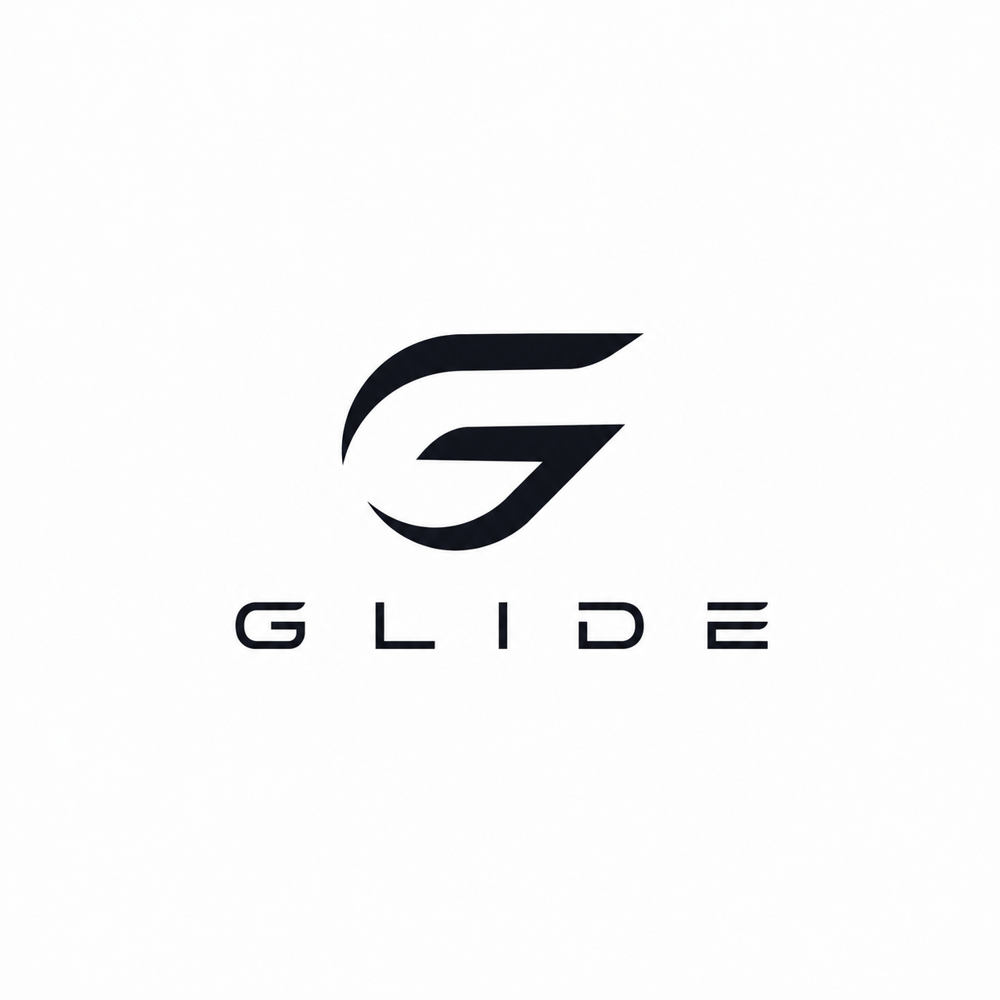

<div align="center">
  
  
  # 🌊 Glide: Autonomous Financial Engine

  **The AI that continuously adapts to your variable income, projecting your future, and protecting your financial priorities.**

  [](https://manage-buddy.web.app)
  [](https://github.com/vgsguru/glide-csi-origin/releases/latest)

</div>

---

## ✨ Overview

For gig workers, freelancers, and variable-income earners, static financial dashboards are fundamentally broken. **Glide** transitions from passive financial tracking to **autonomous financial decision support**. 

By running continuous agentic loops on your local machine, Glide securely parses fragmented bank SMS and email receipts on-device, predicts your income variance, and acts as an Arbitrator to protect your core priorities (like Rent and SIPs) against discretionary spending.

## 🚀 Major Highlights & Integrations

Our architecture pushes the boundaries of AI integration, featuring powerful collaborations:

*   🧠 **TraceCommons.ai**: Powers our underlying entity resolution algorithms and complex financial state pattern recognition, allowing Glide to accurately map wildly irregular income streams into predictable bands.
*   🎙️ **ElevenLabs AI**: Drives the ultra-realistic voice-assisted interactions within our conversational AI chat. Discussing your financial state is now as natural as talking to a human advisor.
*   🔒 **Local-First Privacy (Gemma 4)**: Financial data is highly sensitive. Glide uses a local **Gemma 4 (12B)** LLM to parse bank notifications directly on your machine. Zero cloud API costs. Zero privacy breaches.
*   💧 **Black & White Liquidmorphism**: A stunning, high-contrast UI featuring dynamic SVG fluid blobs, deep glassmorphic layers, and buttery-smooth `framer-motion` transitions.

---

## 📸 Interface Sneak Peek

| Dashboard & Insights | Conversational AI Agent |
| :---: | :---: |
|  |  |
| *Dynamic income bands and real-time Agent arbitration warnings.* | *Gemini-inspired chat interface with inline financial widgets.* |

---

## 🛠️ Architecture & Tech Stack

- **Frontend Core**: React 18, Vite, Tailwind CSS, Framer Motion
- **Backend Services**: Python, Flask, SQLAlchemy, SQLite
- **AI / LLM Infrastructure**: Ollama, Gemma 4:12B
- **Deployment**: Firebase Hosting (`manage-buddy`)

## 🏃‍♂️ Running Locally

1. **Start the AI Engine**
   Make sure you have Ollama running locally with Gemma 4:
   ```bash
   ollama run gemma4:12b
   ```

2. **Start the Backend**
   ```bash
   cd backend
   pip install -r requirements.txt
   python -m app.main
   ```

3. **Start the Frontend**
   ```bash
   cd web
   npm install
   npm run dev -- --port 3000
   ```

---
<div align="center">
  <i>Built with ❤️ for CSI ORIGIN 2026</i>
</div>
