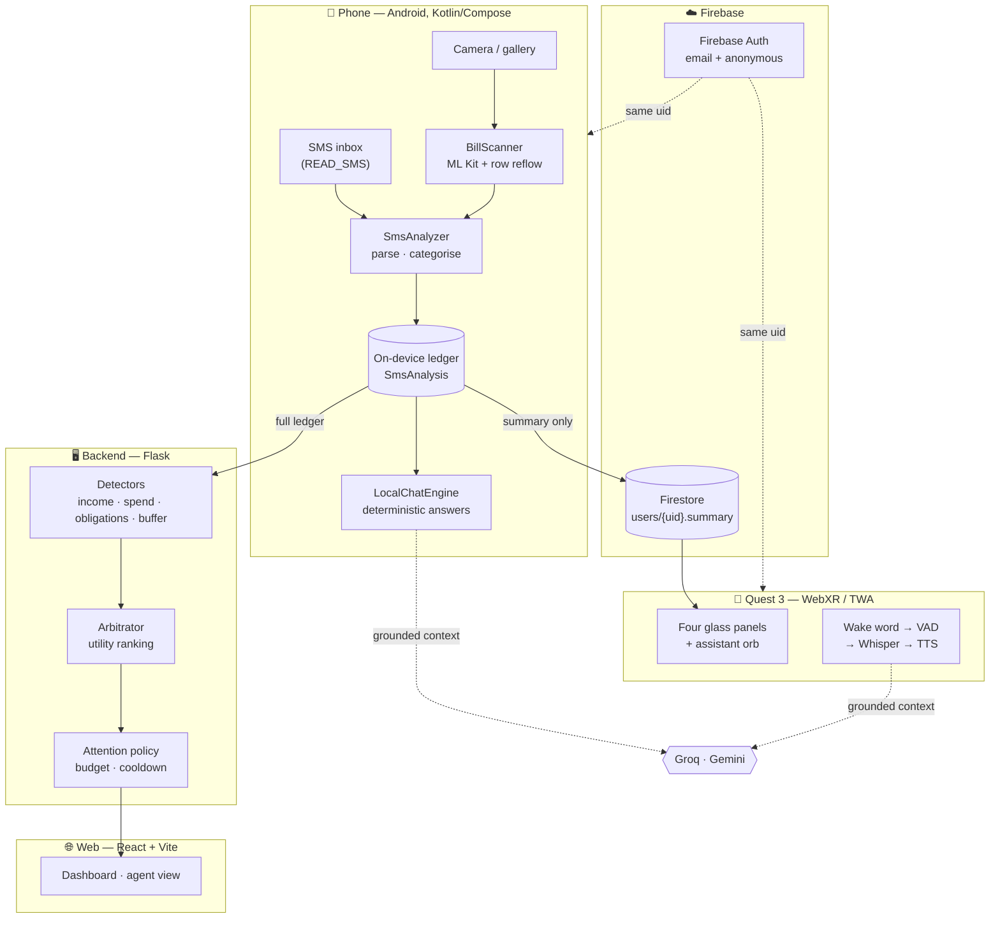

# Glide — Technical Documentation

> Companion to the [README](../README.md). This is the "how it actually works" document:
> architecture, algorithms, data model, and the reasoning behind the decisions that aren't obvious.

---

## Contents

1. [The problem, stated precisely](#1-the-problem-stated-precisely)
2. [System architecture](#2-system-architecture)
3. [The on-device pipeline](#3-the-on-device-pipeline)
4. [Income as a distribution](#4-income-as-a-distribution)
5. [Obligation discovery](#5-obligation-discovery)
6. [Cash–ATM reconciliation](#6-cashatm-reconciliation)
7. [Bill OCR](#7-bill-ocr)
8. [The assistant](#8-the-assistant)
9. [The backend agent](#9-the-backend-agent)
10. [Data model](#10-data-model)
11. [Identity and sync](#11-identity-and-sync)
12. [The VR app](#12-the-vr-app)
13. [Security and privacy](#13-security-and-privacy)
14. [Build and deploy](#14-build-and-deploy)
15. [Constants reference](#15-constants-reference)
16. [Known limitations](#16-known-limitations)

---

## 1. The problem, stated precisely

Conventional personal finance software models income as a **scalar with a period** — ₹X per
month, arriving on day N. Every downstream feature inherits that assumption: budgets divide it,
projections extrapolate it, "can I afford this" subtracts from it.

For roughly 90% of India's workforce that model is wrong in both dimensions. Income arrives in
**irregular amounts** on **irregular days**. Applying a scalar model to a distribution produces
advice that is confidently incorrect, which is worse than no advice.

Glide replaces the scalar with a **distribution plus a floor**:

```
safe_to_spend = max(net_over_window − buffer_floor, 0)
income        = { p10, p50, p90, basis }
```

`buffer_floor` is set by the user and is the amount they never want to drop below. Everything
Glide calls "safe" sits above that line. Both the phone and the headset compute `safe_to_spend`
with this identical expression, so two devices can never disagree about the one number the
product exists to produce.

---

## 2. System architecture



**The phone is the source of truth.** It is the only surface that reads raw messages, and raw
messages never leave it. What leaves is a *summary*: totals, category aggregates, obligation
descriptors. No message bodies, no per-transaction rows.

**The backend is optional.** Every figure the phone displays and every deterministic answer the
assistant gives is computed on-device. The backend adds the objective arbitrator and the web
dashboard; when it is unreachable, the phone degrades to full local function rather than failing.

This was not originally true and it caused a real bug — see [§11](#11-identity-and-sync).

---

## 3. The on-device pipeline

`android/app/src/main/java/app/glide/data/SmsAnalyzer.kt`

```
readInbox(lookback=150d)
  → filter to financial senders
  → per message: extract { amount, direction, merchant, channel, account_hint, timestamp }
  → reject promos / OTPs / failures
  → categorise
  → aggregate over the display window (default 30d)
  → detect obligations over the full 150d lookback
  → reconcile cash
  → SmsAnalysis
```

### Parsing

Amount extraction handles the Indian formats banks actually emit (`Rs.`, `INR`, `₹`, lakh/crore
grouping). Direction comes from verb matching — *debited/spent/paid/withdrawn* versus
*credited/received/deposited*.

### Two parsing bugs worth documenting

Both were found on a real inbox and both are the same class of error — substring matching on
natural language:

- **`to` matched inside `ZOMATO`.** The merchant extractor keyed on the preposition `to` and
  found it inside the merchant name it was trying to extract.
- **`lab` matched inside `available`**, filing balance notifications under Healthcare.

Both fixed by compiling every merchant and category matcher with explicit **word boundaries**.

A third: the top merchant on a real inbox was **`Block`, 131 times** — from the bank boilerplate
*"SMS BLOCK to 567676"*. Fixed with a non-merchant lead filter so instruction text can never be
read as a payee.

The general lesson, and the reason these are documented rather than quietly patched: bank SMS is
adversarial input dressed as prose. Every heuristic needs a real inbox before it can be trusted.

---

## 4. Income as a distribution

Glide reports `p10 / p50 / p90` with the basis stated in plain language
(*"11 deposits over 30 days, 1 tiny credit ignored"*).

### The bug this design exists because of

The first implementation estimated monthly income as `median_credit × credit_count`. On a real
inbox, **39 of 163 credits were under ₹100** — cashback, refunds, ₹1 verification pings. The
median collapsed into that noise and the app reported an income band of **₹65–₹121** against
**₹41,821** of actual credits.

The fix has two parts:

1. Scale the **window total** to the period, rather than trusting a median.
2. Apply an `INCOME_NOISE_FLOOR = 100.0`, below which a credit is not income.

### The bug inside the fix

The corrected version derived the p10–p90 spread purely from observed variance. That made two
similar deposits look like *perfectly stable* income — the app was **most confident exactly when
it had the least evidence**. A test caught it. A small-sample floor now keeps the band honestly
wide until there is enough history to narrow it.

This is the single most important behaviour in the product: an income band that is too narrow is
not a cosmetic bug, it is bad financial advice delivered with false confidence.

---

## 5. Obligation discovery

Nobody enumerates their recurring bills, so Glide learns them from repetition.

Confidence rises with each confirming repeat:

```
confidence = min(0.97, 1 − 0.55^(n−1))
```

| repeats | confidence |
|---|---|
| 2 | 0.45 |
| 3 | 0.70 |
| 4 | 0.83 |
| 5 | 0.91 |
| 6+ | → 0.97 ceiling |

The ceiling is deliberate. A discovered pattern is never certain, and the UI shows the percentage
so the user can judge it.

### Lookback is decoupled from the display window

A monthly bill appears **once** in a 30-day window. With `MIN_OCCURRENCES` on the phone set to 2,
a monthly obligation could *never* be detected while the display window was 30 days — the feature
was structurally incapable of firing, and reported zero recurring payments on an inbox full of them.

Detection now runs over `OBLIGATION_LOOKBACK_DAYS = 150` while totals still display 30 days.

That immediately surfaced a second problem: ₹2 micro-charges are extremely regular and flooded
the list. `MIN_OBLIGATION_AMOUNT = 50.0` clears it.

### Backend variant

The backend (`app/services/classifier.py`) runs a richer version over a 120-day lookback with
`MIN_OCCURRENCES = 3`, and blends three factors:

- `base = 1 − 0.55^(occurrences − 1)`
- `amount_stability` — how tightly the amounts cluster (15% tolerance; utility bills genuinely vary)
- `regularity` — how evenly spaced the dates are (±6 day cadence tolerance)

An obligation goes **dormant** after `DORMANT_AFTER_MISSED = 2` missed cycles rather than being
deleted, because the history is evidence and a resumed subscription should recover its confidence.

---

## 6. Cash–ATM reconciliation

An ATM withdrawal is **not** an expense. It is a transfer from an account you can see into a
pocket you cannot.

```
ATM withdrawal ₹2,000  →  unallocated_cash_pool += 2000     (not counted as spend)
scanned cash bill ₹500 →  unallocated_cash_pool -= 500      (counted as spend, once)
after CASH_AGING_DAYS  →  remaining pool → "Uncategorised cash discretionary"
```

Without this, scanning a cash receipt after an ATM withdrawal counts the money **twice** — the
withdrawal as spend *and* the receipt as spend. On a real ledger that inflated spending by the
full withdrawal amount.

`CASH_AGING_DAYS = 14`. Cash that stays unaccounted past that window becomes uncategorised
discretionary spending, so the overall balance stays honest instead of quietly wrong.

---

## 7. Bill OCR

`android/app/src/main/java/app/glide/data/BillScanner.kt` — ML Kit text recognition,
Play-Services-backed (unbundled).

### The row-reflow problem

ML Kit returns text blocks in **detection order**, not **visual order**. On a two-column
receipt — item names left, prices right — the blocks arrive interleaved, and the first number
you encounter is whatever the recogniser happened to see first.

Our first result on a café bill: **₹20 / "Cappuccino x2"**. The true total was **₹871.50**.

The fix ignores block order entirely and **rebuilds visual rows from bounding-box geometry**:
group by y-centre with a tolerance, sort within each row by x. The same receipt then reads
**₹871.50 / "CAFE MOCHA"**.

A separate `.toInt()` was silently discarding the paise.

### Size

Bundling the ML Kit model took the APK from **14.7 MB → 56.2 MB**. Switching to the
Play-Services-backed variant, which shares the model with the device, brought it to **15.7 MB**.

`Outcome` is a sealed interface — `Text`, `NoText`, `BadImage`, `ModelUnavailable` — so the UI
distinguishes "we could not read this" from "there was nothing to read".

---

## 8. The assistant

### The grounding contract

Every request builds a `CONTEXT` block from the ledger — the *only* facts the model may use. It
carries totals, the floor, safe-to-spend, run-rate, the income band with its basis, message
counts, top categories and discovered obligations.

The chain is:

```
1. Small talk        → answered conversationally, no figures
2. Deterministic     → computed directly from the ledger
3. Groq rephrase     → only if the numeral guard passes
4. On-device answer  → shipped as-is if the network is gone
```

Step 4 is why the assistant still works on a train with no backend and no key.

### The numeral guard

```kotlin
fun numeralsAreGrounded(generated: String, context: String): Boolean {
    val allowed = numerals(context)
    for (value in numerals(generated)) {
        if (value in allowed) continue
        if (value <= 100) continue        // "two or three categories" is prose
        return false
    }
    return true
}
```

Any figure above 100 that the model wrote but the context never contained causes the **entire
rewrite to be discarded** in favour of the deterministic answer. Not flagged, not corrected —
discarded.

This is the central safety property. An assistant that hallucinates your balance is worse than
no assistant, because it is trusted.

### Conversational behaviour

An earlier version treated every message as a money question, so *"hi, how are you"* returned a
balance report. That is not a copilot, it is a vending machine. Greetings, thanks and farewells
now get short human replies; figures appear when the question is about money. The numeral guard
never relaxes.

### Voice

| Stage | Implementation |
|---|---|
| Capture | `getUserMedia` + WebAudio RMS **energy VAD** (phone: `SpeechRecognizer`) |
| Wake word | `"hey glide"` matched against the transcript, with near-miss variants |
| STT | Groq `whisper-large-v3-turbo` |
| Reasoning | Groq `openai/gpt-oss-120b`, grounded + guarded |
| TTS | Gemini `gemini-3.1-flash-tts-preview`, voice *Kore* |

The VAD is what makes always-on listening affordable: audio uploads only for an actual utterance,
never as a continuous stream.

**Two implementation notes that cost real time:**

- Gemini TTS returns **headerless PCM L16 at 24 kHz**. It must be wrapped in a 44-byte WAV header
  before any decoder will touch it.
- Both Groq and Gemini default to a hidden reasoning pass. Disabling it
  (`thinkingConfig.thinkingBudget = 0`) took answers from **26s → 1.3s**. The local gemma path
  went **90s → 13s** with `"think": false`.

Spoken text is also humanised first — `"Rs.12,000"` read literally becomes
*"R S dot twelve comma zero zero zero"*.

### Why voice is half-duplex

We built against Gemini's **Live API** (`bidiGenerateContent`) for true full-duplex speech. Every
authentication route failed identically: `1008 Expected OAuth 2 access token`. Query parameter,
`x-goog-api-key` header, bearer token — all rejected. The endpoint requires OAuth2 and will not
accept an API key, which no error message we received ever said.

The shipped loop is half-duplex with barge-in: **listen → think → speak → reopen the mic**.
It behaves like a conversation. It is not full-duplex, and we would rather say so.

---

## 9. The backend agent

`backend/app/agent/` — the part that decides *what to say without being asked*.

### Detectors → signals

`income.py`, `spend.py`, `obligations.py`, `buffer.py` each emit **signals** carrying an
objective, a magnitude and a severity.

### Arbitration

Signals compete. The winner is not the largest number, it is the one that matters most **to this
user**, given their stated priorities and risk posture:

```python
posture   = 1.6 − (risk_tolerance / 100)          # 0 → 1.6x, 100 → 0.6x
weight    = priority_weights[signal.objective]     # earlier in the user's list → heavier
severity  = {"critical": 1.35, "warn": 1.12, "info": 1.0}[signal.severity]

utility   = weight × posture × (0.35 + 0.65 × normalized_magnitude) × severity
```

The `0.35 + 0.65 × magnitude` shape matters: a small signal on a high-priority objective can
still outrank a large signal on one the user does not care about. Magnitude contributes, but it
does not dominate.

**This is demonstrable**: reorder a user's priorities and the ranking flips, with the same
underlying data.

### Attention policy

`policy.py` — being right is not enough; a copilot that talks constantly gets muted.

| Constant | Value | Meaning |
|---|---|---|
| `ATTENTION_BUDGET` | 3 | Maximum cards surfaced per tick |
| `COOLDOWN_DAYS` | 2 | A dismissed insight stays quiet this long |
| `RESURFACE_MAGNITUDE_DELTA` | 0.30 | …unless it got 30% worse |
| `MIN_UTILITY` | 0.12 | Below this, never surface at all |

### Endpoints

| Method | Path | Purpose |
|---|---|---|
| `POST` | `/auth/signup`, `/auth/login` | Bearer token issue |
| `GET` | `/auth/me` | Session source of truth |
| `POST` | `/sms/ingest`, `/sms/ingest_batch` | Raw message ingest |
| `GET` | `/dashboard/state`, `/projection`, `/timeline`, `/obligations` | Read models |
| `GET/POST/PATCH/DELETE` | `/transactions/...` | Ledger CRUD + `/review_queue` |
| `POST` | `/agent/tick` | Run detectors → arbitrate → apply policy |
| `GET` | `/agent/insights`, `/agent/runs` | Surfaced cards and run history |
| `POST` | `/agent/insights/{id}/dismiss`, `/act` | Feedback into the policy |
| `POST` | `/chat/send`, `GET /chat/history`, `/chat/suggestions` | Grounded chat |
| `GET/PATCH` | `/profile` | Priorities, risk tolerance, buffer floor |

Auth uses `itsdangerous` for signed bearer tokens and `werkzeug` for password hashing — both are
already Flask dependencies, so authentication added **zero** new packages.

---

## 10. Data model

```python
User
  email, name, password_hash
  income_type      # variable | salaried | mixed
  risk_tolerance   # 0 conservative .. 100 aggressive
  priorities       # ordered JSON list — drives arbitration
  buffer_floor     # default 10000.0
  currency         # INR

Transaction
  amount, direction        # CREDIT | DEBIT
  merchant, category
  account_hint             # "HDFC XX4521"
  channel                  # UPI | CARD | NETBANKING | ATM | CASH
  occurred_at
  is_recurring, obligation_id
  confidence               # 0..1
  has_conflict, needs_review
  dedupe_key               # entity resolution key
```

### Entity resolution

The same payment can arrive by SMS, email and a scanned receipt. Evidence combines rather than
overwrites:

```
confidence = 1 − Π(1 − confidence_i)
```

Merge window: **±2% amount, 72 hours**. Source authority is `MANUAL > OCR > EMAIL > SMS` — a
human correction always wins, and `needs_review` is set when sources genuinely conflict rather
than silently picking one.

---

## 11. Identity and sync

Firebase Auth issues the identity. The phone signs in (anonymous, upgradeable to email/password
via `linkWithCredential`, which **preserves the uid**). The headset signs in with the same
credentials and therefore resolves to the same uid.

Firestore rules scope everything to that uid:

```javascript
match /users/{uid} {
  allow read, write: if request.auth != null && request.auth.uid == uid;
}
match /{document=**} { allow read, write: if false; }
```

There is deliberately **no public read path** anywhere in the rules file.

### The sync bug

The Firestore mirror originally lived *inside* `syncToBackend()`, and ran only **after** a
successful `syncTransactions` call to the Flask backend. Away from the dev machine that backend
is unreachable, the call threw, and the mirror never executed. The headset therefore showed
*"No data yet"* permanently, on an account whose phone had a fully parsed ledger.

The fix inverts the dependency. `mirrorToCloud()` is independent, runs **first**, and fires:

- after every inbox scan
- whenever the buffer floor changes

`bufferFloor` is now part of the synced summary, so the headset stops guessing at the floor and
computes the identical `safe_to_spend`.

The general lesson: **the optional dependency must not be able to take down the essential one.**

---

## 12. The VR app

`web/public/vr/` — plain ES modules, three.js r169, no build step.

### Why WebXR and not Unity

Quest runs Android, so a native app means Unity or Unreal with the Meta XR SDK. Meta also
documents a first-class route for web apps: package a WebXR PWA with **Bubblewrap** into a
Trusted Web Activity. That produces a real, installable APK that appears in the headset library,
launches to a Horizon panel, and enters fully immersive mode via `requestSession`.

It reuses the entire web stack, ships a **1.6 MB** APK, and updates by deploying — no reinstall.

### The room

Four panels on an arc at `RADIUS = 1.95 m`, `y = 1.52 m`, base azimuths `[−0.62, −0.21, 0.21, 0.62] rad`.
Focusing a panel rotates the whole arc so the chosen one arrives dead ahead:

```js
// Rotating the arc by +theta moves a panel from azimuth a to a − theta,
// so bringing the chosen one to the front means rotating by its own angle.
rigTargetY = BASE_ANGLES[focus];
```

The user never moves; the panels come to them. That keeps a fifteen-minute finance review
comfortable and avoids the nausea of moving the camera.

Panels are canvas textures rendered at **900 px per metre** so text stays sharp through the
lenses. Cost: **49 draw calls, 536 triangles**.

### Interaction

| Input | Action |
|---|---|
| `"Hey Glide"` | Wake the assistant |
| Squeeze | Talk without the wake word |
| Trigger on a panel or tab | Bring it to the front |
| Trigger on empty space | Talk |
| Thumbstick ← / → | Cycle tabs |
| Arrow keys / 1–4 | Same, in on-screen preview |

### Passthrough

`immersive-ar` gives passthrough on Quest. Switching hides the grid, floor and light blooms,
nulls `scene.background`, and sets `clearAlpha(0)` so the real room composites behind the panels.
The renderer is created with `alpha: true` for exactly this.

Voice commands `"passthrough"` and `"vr mode"` swap sessions.

### Three bugs worth recording

- **The microphone was requested *after* entering the immersive session.** A permission prompt
  cannot be drawn inside an XR session, so it failed silently and the voice agent looked broken.
  It is now requested on the flat page, before entry.
- **TWAs delegate permissions from the host APK**, and Bubblewrap does not emit `RECORD_AUDIO`.
  Added to the manifest by hand.
- **The service worker was cache-first**, so the first launch after every deploy ran the
  *previous* build — which made every fix look like it had not worked. It is now network-first
  with the cache as an offline fallback; only the immutable vendored three.js stays cache-first.

---

## 13. Security and privacy

**What never leaves the device:** message bodies, per-transaction rows, merchant-level detail,
and any audio outside a detected utterance.

**What does leave:** aggregate summaries to Firestore (scoped to your uid), and a grounding
context to the model provider when you ask a question.

**Signing:** both APKs share one certificate,
SHA-256 `2A:8D:6F:…:B9:4D`. The Quest TWA is bound to the origin by Digital Asset Links at
`/.well-known/assetlinks.json`, which is why it runs without browser chrome.

**Keys.** Kept out of the repository — Android reads them via `BuildConfig` from gitignored
`local.properties`; the web VR app from a gitignored `config.js` with a committed
`config.example.js`. They are still **present in any published build**, because a static web app
and an APK must carry whatever they call. A backend proxy is the real fix and is not built.

> ⚠️ Keys committed to this repository **before** that change remain in git history. Rotation is
> the only remedy; removing a file from the working tree does not remove it from history.

---

## 14. Build and deploy

### Prerequisites

JDK 21, Android SDK (platforms 35 + 36, build-tools 36.1), Gradle 8.11.1, Node 24.

### Commands

```bash
# Web
cd web && npm install && npm run build

# Deploy web + VR to Firebase Hosting
npx firebase deploy --only hosting --project manage-buddy

# Android  (keys first in android/local.properties)
cd android && gradle assembleRelease
# → app/build/outputs/apk/release/app-release.apk

# Quest APK
cd quest && gradle assembleRelease
apksigner sign --ks glide-release.jks --ks-key-alias glide \
  --out glide-vr.apk app/build/outputs/apk/release/app-release-unsigned.apk

# Install
adb install -r app-release.apk        # phone
adb install -r glide-vr.apk           # Quest 3, Developer Mode on
```

### Local config

`android/local.properties`
```properties
GROQ_API_KEY=...
GEMINI_API_KEY=...
```

`web/public/vr/config.js` — copy from `config.example.js` and fill in.

### Gotchas

- Bubblewrap expects the legacy `<sdk>/tools` layout; symlink or junction it to
  `cmdline-tools/latest`.
- Bubblewrap fetches the web manifest from the **live URL** at generation time, so `/vr/` must be
  deployed before `bubblewrap update` will succeed.
- Firebase Hosting's default `ignore` includes `**/.*`, which silently drops
  `.well-known/assetlinks.json`. Remove it or the TWA will not verify.

---

## 15. Constants reference

### Phone — `SmsAnalyzer.kt`

| Constant | Value | Why |
|---|---|---|
| `OBLIGATION_LOOKBACK_DAYS` | 150 | A monthly bill appears once in 30 days |
| `MIN_OCCURRENCES` | 2 | Two repeats before a pattern is claimed |
| `MIN_OBLIGATION_AMOUNT` | 50.0 | Keeps ₹2 micro-charges out |
| `INCOME_NOISE_FLOOR` | 100.0 | Cashback and ₹1 pings are not income |
| `CASH_AGING_DAYS` | 14 | Unaccounted cash becomes discretionary |

### Backend — `classifier.py` / `policy.py`

| Constant | Value |
|---|---|
| `MIN_OCCURRENCES` | 3 |
| `AMOUNT_TOLERANCE` | 0.15 |
| `CADENCE_TOLERANCE_DAYS` | 6 |
| `DORMANT_AFTER_MISSED` | 2 |
| `MIN_CONSISTENT_RATIO` | 0.6 |
| `MIN_REGULARITY` | 0.35 |
| `ATTENTION_BUDGET` | 3 |
| `COOLDOWN_DAYS` | 2 |
| `RESURFACE_MAGNITUDE_DELTA` | 0.30 |
| `MIN_UTILITY` | 0.12 |

### VR — `app.js`

| Constant | Value |
|---|---|
| `RADIUS` | 1.95 m |
| `PANEL_Y` | 1.52 m |
| `BASE_ANGLES` | −0.62, −0.21, 0.21, 0.62 rad |
| Panel resolution | 900 px/m |

---

## 16. Known limitations

Stated plainly, because a reviewer will find them anyway.

| Limitation | Status |
|---|---|
| API keys ship inside published builds | Inherent to client-only; needs a backend proxy |
| Keys in pre-existing git history | **Rotation required** |
| `"Unknown"` is the top merchant, ~40% of ledger | Needs a bank-template corpus that does not exist |
| Objective arbitrator is backend-only | Not ported to the phone |
| Deployed web app points at a local backend | Demo surface, not usable by a stranger |
| Voice is half-duplex | Gemini Live requires OAuth2, rejects API keys |
| Quest passthrough, rays, thumbstick, live mic | Verified by code and logs; not yet by a worn-headset session |

---

<div align="center">
<sub>Built for CSI Origin 2026 · <a href="../README.md">README</a></sub>
</div>
